##以下包括本人玩电脑以来发现的很多有用的小的零散的东西。

>仅作记录
>

1. cmd命令行里神奇的`tree`，可以显示出目录文件结构，就像这样。   
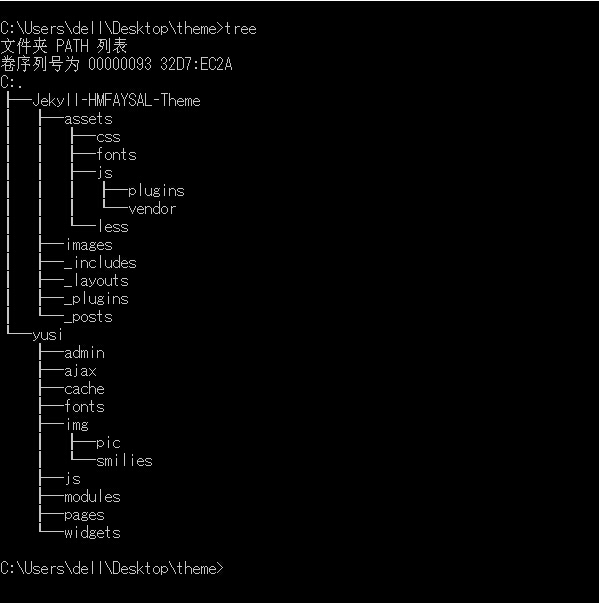   
不过只能显示文件夹，不能显示文件。    

2. 如果你的cmd开了快速编辑模式的话，就可以直接将其拷贝出来，而且就可以在cmd里右击直接粘贴了，再也不用小心翼翼的敲命令了。  
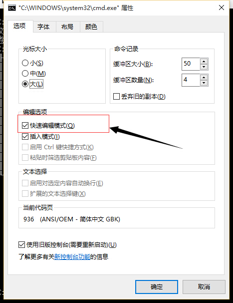   
把上面的目录结构拷贝出来就是这个样子的。   
```
C:\Users\dell\Desktop\theme>
├─Jekyll-HMFAYSAL-Theme
│  ├─assets
│  │  ├─css
│  │  ├─fonts
│  │  ├─js
│  │  │  ├─plugins
│  │  │  └─vendor
│  │  └─less
│  ├─images
│  ├─_includes
│  ├─_layouts
│  ├─_plugins
│  └─_posts
└─yusi
    ├─admin
    ├─ajax
    ├─cache
    ├─fonts
    ├─img
    │  ├─pic
    │  └─smilies
    ├─js
    ├─modules
    ├─pages
    └─widgets
```   

4. 让cmd里显示utf-8的中文。
因为cmd本身无法显示utf-8的中文，只能显示GBK的中文。如果想要显示utf-8的中文的话，输入`chcp 65001`    
方可显示utf-8格式编码中文,输入`chcp 936`,仍然显示GBK的中文     
>如果cmd中仍然无法显示utf-8的中文，选择属性，改变字体为`Lucida Console`点阵字体。

6. 有时候不得不需要下载一些百度文库里的东西，一般我是拒绝这样做的。因为我有大量的百度云搜索。   
>[http://www.kanbuchuan.com/so/](http://www.kanbuchuan.com/so/)                       
>[http://kaopu.so/](http://kaopu.so/)                           
>[http://www.iwapan.com/](http://www.iwapan.com/)                             
>[http://www.panzz.com/](http://www.panzz.com/)                              
>[http://www.bdyunso.com/](http://www.bdyunso.com/)                            
>[http://www.pansou.com/](http://www.pansou.com/)                          
>[http://www.wangpansou.cn/](http://www.wangpansou.cn/)                              
>[http://pan.java1234.com/](http://pan.java1234.com/)                                 
>[http://www.kanbuchuan.com/so/](http://www.kanbuchuan.com/so/)                          
>[http://www.daysou.com/](http://www.daysou.com/)                              
>[http://www.panc.cc/](http://www.panc.cc/)                                   
>[http://www.baidu10.net/](http://www.baidu10.net/)                              
>[http://www.yiso.me/](http://www.yiso.me/)                                    
>[http://so.xpan.me/index.html](http://so.xpan.me/index.html)                         
>[http://www.soupan.info/](http://www.soupan.info/)                                 
    
    好吧，就这些，一般都能够找到想要的资料，但是如果实在是没有找到而且在百度文库里发现了想要下载的却提示需要积分的时候，内心是崩溃的。        
这个时候，我们就需要这个了，[冰点文库](../software/iDocDown.rar)，输入百度文库的网址即可下载，自动下载转化为TXT和PDF格式，还是非常好用的。我的这个是免安装无广告版，之前我也在网上找到一个，又有广告又需要安装。。。。

7. 在Windows命令行上执行Linux命令，或许你需要--GetGnuWin32。     
 - 下载[GetGnuWin32-0.6.3](../software/GetGnuWin32-0.6.3.exe)，运行。       
 - 进入GetGnuWin32的安装目录，运行`download.bat`,它会自动从网上下载你需要的Linux命令。（可能需要很长时间）        
 - 运行`install.bat`，就可以在cmd上使用Linux命令了。            

14. `The NPF driver isn't running.You may have trouble,capturing or listing interfaces.`在wireshark启动的时候遇到了这个问题，原因是`NPF`服务没有打开，在Windows下打开管理员权限的cmd，输入`net start npf`即可，在Linux下即是先获得管理员权限。

15. 在Windows下自带的截屏小工具是`snippingtool`在cmd或者是运行窗口，输入，确定，即可打开。

16. 在Ubuntu下自带的截屏小工具是`gnome-screenshot`，参数`-a`捕获指定内容。          

17. `cmder`再也不用忍受难看的cmd了，不仅将比cmd更好看，还自动集成了Linux下命令，比之前推荐的`GetGnuWin32`更强大。                              
>下载[cmder](../software/cmder.zip)，安装。                       
>将`cmder`的安装路径和`bin`目录都加入环境变量。
>享受`cmder`吧。                   

18. 在Windows下打开cmd的几种方法。              
    1. Windows键加R键，出现运行，输入`cmd`，确认即可。            
    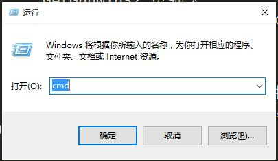             
    2. Windows键加X键，找到命令提示符，选择点击即可。           
    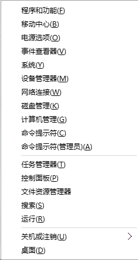        
    3. 在开始菜单上右击，找到命令提示符，选择点击即可。                     
    4. 在所有程序里找到cmd。            
    5. 在`C:\Windows\System32`目录下找到cmd.exe                   
    6. 选择某个文件夹，按住shift键，右击选择在此处打开命令行窗口

19. 简单好用截屏小工具[FastStone Capture](../software/FSCapture.zip)，不仅仅能截图，各种图，还能做一点简单基本的图片处理。           
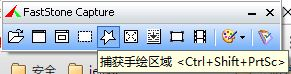         

20. [TakeColor](../software/TakeColor.zip)能拾取屏幕上任意像素的颜色，简单实用。        
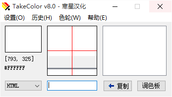    

21. [Everything](../software/Everything.zip)帮你方便快速的找东西。   
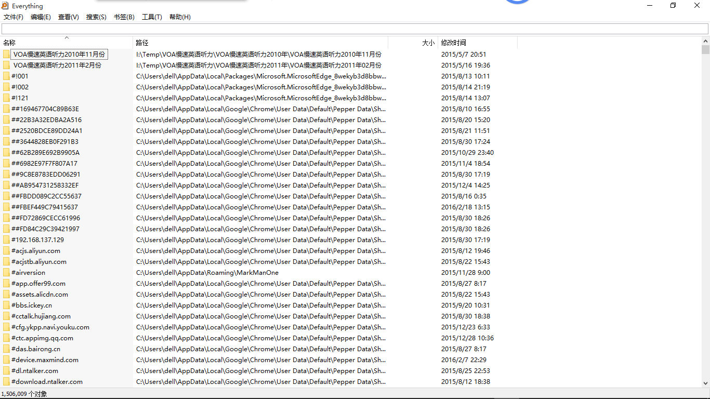

22. [Inpaint](../software/Inpaint.zip)简单快速的去除图片水印，确实是很多的PS软件都可以做到这一点，但是它只做这一点，而且操作简单。

23. [PhotoZoomPortable](../software/PhotoZoomPortable.zip)图片无损放大，这个就有一点神奇了，将一个像素比较小的图片放大为像素比较大的图片。

24. [ScreenToGif](../software/ScreenToGIF.zip) 在当前屏幕截取GIF        
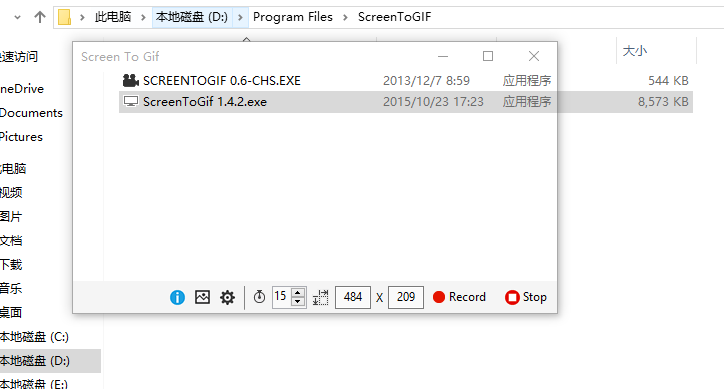

25. [Shadowsocks](../software/Shadowsocks-win-2.5.6.zip) 翻墙的梯子

26. [UltraISO软碟通](../software/UltraISO.zip)，用来制作U盘启动盘，用于装系统。
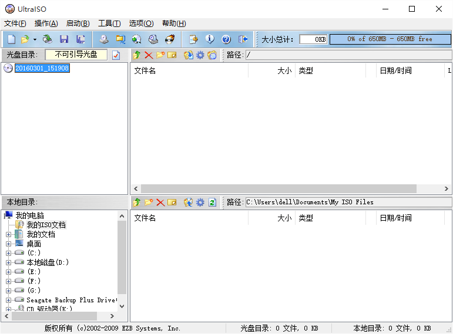

27. [DiskGenius](../software/DiskGenius.zip)用于磁盘分区，误删文件找回，修复系统启动项
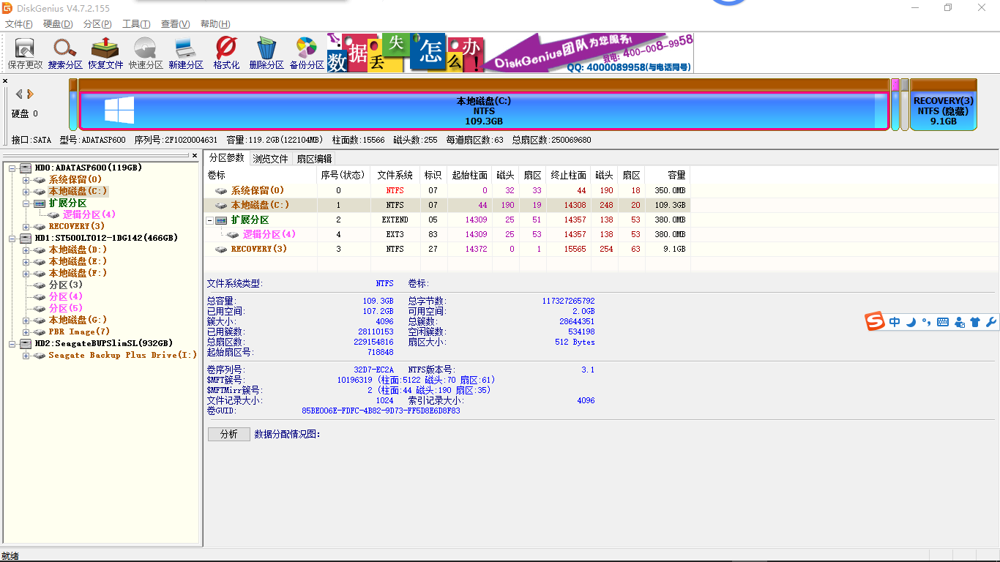

28. [IMGtoISO](../software/IMGtoISO.zip)将img格式的镜像文件转换为ISO格式的镜像文件
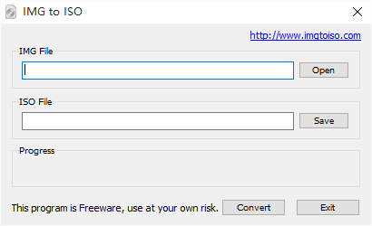

29. [EasyBCD](../software/EasyBCD.zip)在装双系统时添加系统引导
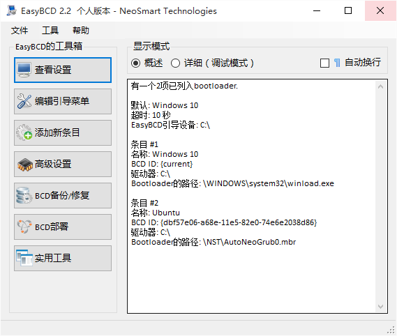

30. [win32DiskImager](../software/win32DiskImager.zip)将系统写入SD卡，在玩树莓派或者相关的单片式计算机时会用到    


31. [Panasonic_SDFormatter](../software/Panasonic_SDFormatter.zip)在将系统写人SD卡时会将内存卡的文件格式改变，使内存卡存储空间变小而无法使用，但你不在需要将这个内存卡用于树莓派时可以使用这个软件来将内存卡恢复。         
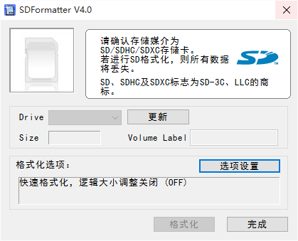

32. [vim](../software/vim74.rar) 不解释，神的编辑器。在Windows上使用。
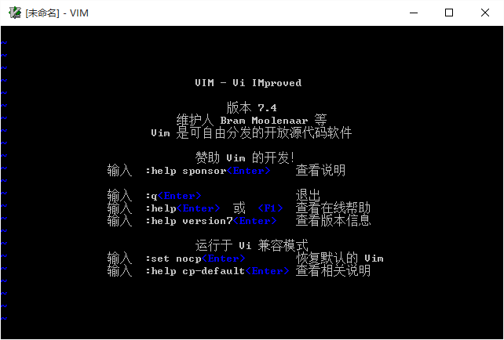

33. [Vitrite](../software/Vitrite.zip) 能让应用背景虚化，非常炫酷，也在某些时候有一定的作用。 
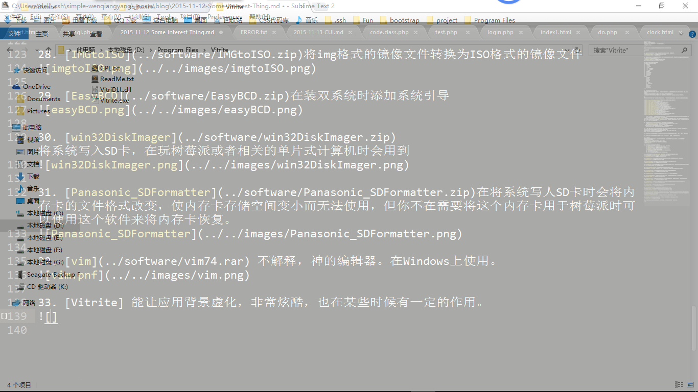

34. [CCleaner](../software/CCleaner.rar) 清理垃圾注册表，简单实用。

35. [flu.x](../software/flu.x.zip)护眼神器，经常用电脑注意保护眼睛，它能够根据你当前经纬度判断日落时间来控制你的电脑亮度，Windows，Ubuntu，mac都有相应的版本。

36. [Clover](../software/Clover_Setup_3.0.406.zip) 将你的文件管理器变成像浏览器一样，如果你喜欢谷歌浏览器，那么你也会喜欢这个。
