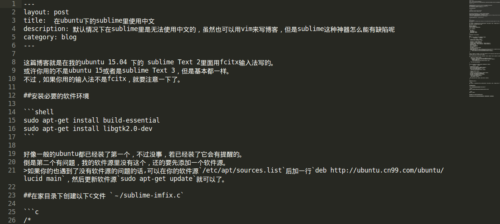

这篇博客就是在我的ubuntu 15.04 下的 sublime Text 2里面用fcitx输入法写的。                  
或许你用的不是ubuntu 15或者是sublime Text 3，但是基本都一样。                     
不过，如果你用的输入法不是fcitx，就要注意一下了。               


##安装必要的软件环境

```shell
sudo apt-get install build-essential
sudo apt-get install libgtk2.0-dev
```

好像一般的ubuntu都已经装了第一个，不过没事，若已经装了它会有提醒的。                         
倒是第二个有问题，我的软件源里没有这个，还的要先添加一个软件源。                        
>如果你的也遇到了没有软件源的问题的话,可以在你的软件源`/etc/apt/sources.list`后加一行`deb http://ubuntu.cn99.com/ubuntu/ lucid main`，然后更新软件源`sudo apt-get update`就可以了。                   

##在家目录下创建以下c文件 `～/sublime-imfix.c`

```c
/*
sublime-imfix.c
Use LD_PRELOAD to interpose some function to fix sublime input method support for linux.
By Windard
 
gcc -shared -o libsublime-imfix.so sublime-imfix.c `pkg-config --libs --cflags gtk+-2.0` -fPIC
LD_PRELOAD=./libsublime-imfix.so subl
*/
#include <gtk/gtk.h>
#include <gdk/gdkx.h>
typedef GdkSegment GdkRegionBox;

struct _GdkRegion
{
  long size;
  long numRects;
  GdkRegionBox *rects;
  GdkRegionBox extents;
};

GtkIMContext *local_context;

void
gdk_region_get_clipbox (const GdkRegion *region,
            GdkRectangle    *rectangle)
{
  g_return_if_fail (region != NULL);
  g_return_if_fail (rectangle != NULL);

  rectangle->x = region->extents.x1;
  rectangle->y = region->extents.y1;
  rectangle->width = region->extents.x2 - region->extents.x1;
  rectangle->height = region->extents.y2 - region->extents.y1;
  GdkRectangle rect;
  rect.x = rectangle->x;
  rect.y = rectangle->y;
  rect.width = 0;
  rect.height = rectangle->height;
  //The caret width is 2;
  //Maybe sometimes we will make a mistake, but for most of the time, it should be the caret.
  if(rectangle->width == 2 && GTK_IS_IM_CONTEXT(local_context)) {
        gtk_im_context_set_cursor_location(local_context, rectangle);
  }
}

//this is needed, for example, if you input something in file dialog and return back the edit area
//context will lost, so here we set it again.

static GdkFilterReturn event_filter (GdkXEvent *xevent, GdkEvent *event, gpointer im_context)
{
    XEvent *xev = (XEvent *)xevent;
    if(xev->type == KeyRelease && GTK_IS_IM_CONTEXT(im_context)) {
       GdkWindow * win = g_object_get_data(G_OBJECT(im_context),"window");
       if(GDK_IS_WINDOW(win))
         gtk_im_context_set_client_window(im_context, win);
    }
    return GDK_FILTER_CONTINUE;
}

void gtk_im_context_set_client_window (GtkIMContext *context,
          GdkWindow    *window)
{
  GtkIMContextClass *klass;
  g_return_if_fail (GTK_IS_IM_CONTEXT (context));
  klass = GTK_IM_CONTEXT_GET_CLASS (context);
  if (klass->set_client_window)
    klass->set_client_window (context, window);

  if(!GDK_IS_WINDOW (window))
    return;
  g_object_set_data(G_OBJECT(context),"window",window);
  int width = gdk_window_get_width(window);
  int height = gdk_window_get_height(window);
  if(width != 0 && height !=0) {
    gtk_im_context_focus_in(context);
    local_context = context;
  }
  gdk_window_add_filter (window, event_filter, context);
}
```

##编译sublime-imfix.c

```shell
gcc -shared -o libsublime-imfix.so sublime-imfix.c `pkg-config --libs --cflags gtk+-2.0` -fPIC
```

##加载编译好的模块

```shell
export LD_PRELOAD=./libsublime-imfix.so subl
```

```shell
source ~/.bashrc
```

现在你使用`subl`打开sublime就可以输入中文了。

但是这样还没完，你只有每次都加载了这个模块才能够在sublime里使用中文，比如说你重新打开一个终端，输入`subl`打开sublime就无法输入中文了。           

##最后的修改

先把家目录下生成的`~/libsublime-imfix.so`移动到你的sublime安装目录下。


```shell
sudo mv ~/libsublime-imfix.so /opt/Sublime_Text_2
```

然后修改你的`subl`，将你的`/usr/bin/subl`改为以下内容，注意你自己的sublime安装目录。                    

```bash
#!/bin/sh

export LD_PRELOAD=/opt/Sublime_Text_2/libsublime-imfix.so
exec /opt/Sublime_Text_2/sublime_text "$@"
```

>在我的电脑里原来的`subl`竟然有8M，只是一个小小的链接而已，太恐怖了。
>在你将`subl`的内容修改了之后，可能还需要更改一下权限才能够使用

现在你就可以任何终端上输入`subl`来打开sublime并输入中文了。           
