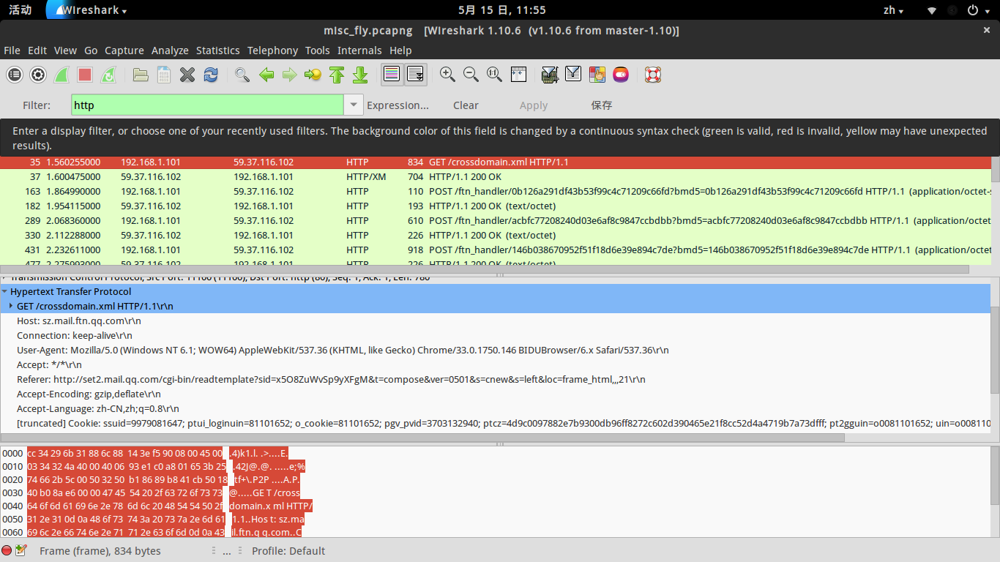
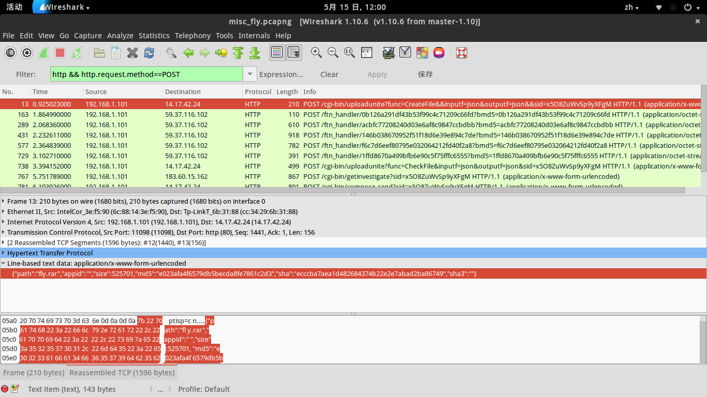
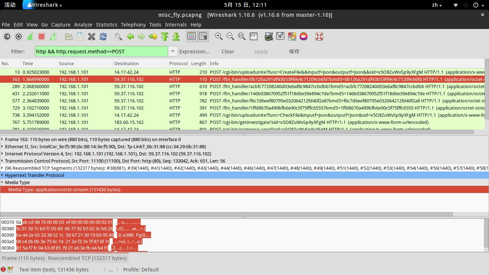
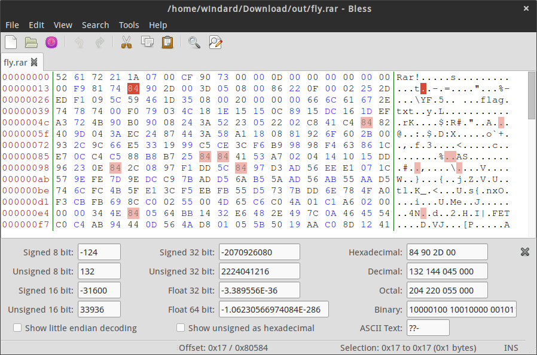
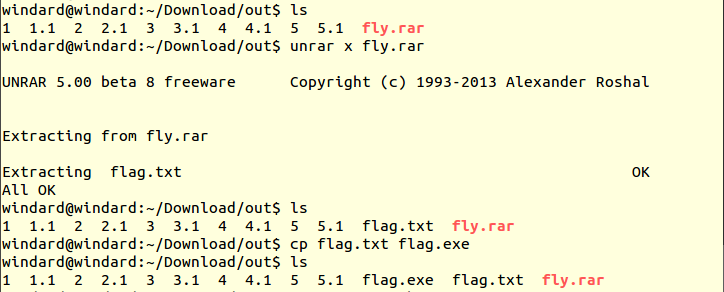
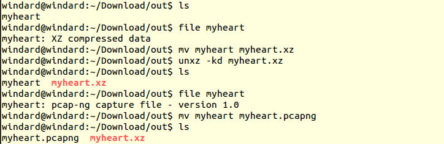
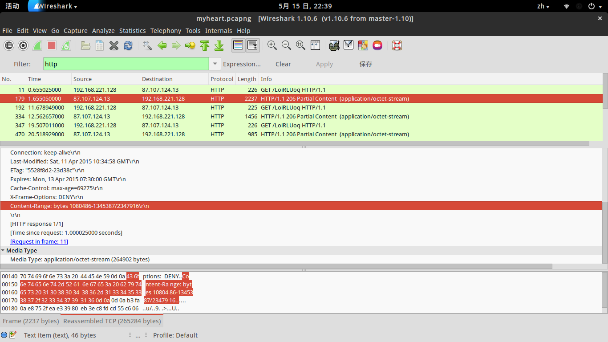
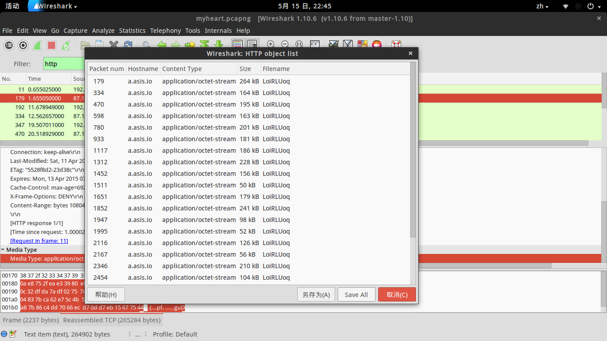

## 0x01 Fly
idf 实验室-包罗万象-[捉到一只苍蝇](http://ctf.idf.cn/index.php?g=game&m=article&a=index&id=57)

```
报告首长！发现一只苍蝇。。

在哪？

here!

卧槽？！好大一坨苍蝇。。


文件地址： http://pan.baidu.com/s/1bnGWbqJ

提取码：oe6w

PS：flag写错了，太麻烦也懒得改了，格式还是wctf{...}，大家明白就好，不要在意这些细节。。
```

把文件下载下来，misc_fly.pcapng 是一个wireshark的数据包，用wireshark打开，首先过滤出http包，可以看到是一个qq邮箱的通信过程。

`Filter:http`



既然是qq邮箱的通信过程，因为邮件的数据内容都是通过post请求发送的，那我们再看一下post请求发送了什么内容。

`Filter:http && http.request.method==POST`



有一个rar的压缩包文件，还有关于这个文件的一些信息。

```
{
    "path":"fly.rar",
    "appid":"",
    "size":525701,
    "md5":"e023afa4f6579db5becda8fe7861c2d3",
    "sha":"ecccba7aea1d482684374b22e2e7abad2ba86749",
    "sha3":""
}
```

看来我们需要做的就是将这个wireshark数据包中的文件提取出来，查看接下来的几个post请求，发现 midia type 都是数据流的格式，猜测这几个数据流里就是我们需要的文件。



接连五个数据包都是数据流格式的post请求，分别是 163，289，431，577，729号数据包，而且每个数据包还标记了数据的大小，分别是 131436，131436，131436，131436，1777byte 。一共是 527521 个 byte，对比第一个数据包里提到的文件大小， (527521-525701)/5=364 也就是说将数据提取出来之后，每个数据包的部分还是会有一些其他的头部信息 364 byte 的部分需要去掉，然后再将5个文件合并成rar压缩文件。

首先让我们来提取文件，可以先选中 `Media Type: application/octet-stream (131436 bytes)` 的部分，然后在 File->Export Selected Packet Bytes 将数据包一个一个的导出，或者是在 File->Export Objects->HTTP 中选中那5个数据包文件，将其导出。

导出之后，将每个数据包的前364个byte的内容去掉。

```
dd if=1 bs=1 skip=364 of=1.1
dd if=2 bs=1 skip=364 of=2.1
dd if=3 bs=1 skip=364 of=3.1
dd if=4 bs=1 skip=364 of=4.1
dd if=5 bs=1 skip=364 of=5.1
```


然后合并文件，让我们看一下合并之后的文件的md5值是不是与前面提到的一致。

`cat *.1>fly.rar`


md5 是 `e023afa4f6579db5becda8fe7861c2d3`，确实是与上面提到的一致，那接下来解密rar文件。

`unrar x fly.rar`


发现需要密码，并不知道密码，不过发现这个文件头有问题，网上搜了一下，发现是伪加密。

将文件头0x1674后面的84改为80。（84为加密，80/20不加密）



现在就可以正常解压，解压结果是一个 flag.txt，打开看一下发现是乱码，并不是真正的txt文件，看一下文件类型，发现是原来是一个 windows 下的小程序，改文件后缀名在windows下跑一遍,着实是苍蝇满屏幕乱跑，可怕。。。



可是一个满屏幕爬苍蝇，flag在哪里吖？binwalk 看一下里面还有什么东西，发现一堆的图片，弄出来看看。

```
binwalk flag.txt
foremost -v -i flag.txt
```

导出来89个图片，好家伙，在图片里发现一个二维码，用手机扫一扫，终于出来了flag，`flag{m1Sc_oxO2_Fly}`。

## 0x02 Broken heart
文件地址 ： [http://ctf5.simplexue.com/misc/myheart](http://ctf5.simplexue.com/misc/myheart)

首先使用file命令查看文件类型，发现是xz格式的压缩包，该文件名解压。发现还是一个一模一样文件名的文件，再查看文件类型，是一个wireshark的数据包，改文件名用 wireshark 打开。

```
windard@windard:~/Download/out$ ls
myheart
windard@windard:~/Download/out$ file myheart
myheart: XZ compressed data
windard@windard:~/Download/out$ mv myheart myheart.xz
windard@windard:~/Download/out$ unxz -kd myheart.xz
windard@windard:~/Download/out$ ls
myheart  myheart.xz
windard@windard:~/Download/out$ file myheart
myheart: pcap-ng capture file - version 1.0
windard@windard:~/Download/out$ mv myheart myheart.pcapng
windard@windard:~/Download/out$ ls
myheart.pcapng  myheart.xz
```



用 wireshark 同样的找到 http 请求，发现没有post请求，但是有很多的get请求是文件流的形式，怀疑是一个文件。

然后在http的请求头中发现了一行 `Content-Range: bytes 1080486-1345387/2347916\r\n` 刚好前面俩数字之差为这一份数据的大小。



一共有23个数据包，每个数据包都记录了它在整个文件中的位置，将这些数据包都提取出来，然后再按照相应的位置将文件拼起来。

同样在 File->Export Object->HTTP 将所有数据包都导出。



将每一个数据包的所在的起始位置和终止位置记录下来，然后写一个脚本将数据包合并起来。

```
windard@windard:~/Download/out$ strings myheart.pcapng | grep 'Content-Range'
Content-Range: bytes 1080486-1345387/2347916
Content-Range: bytes 986065-1150874/2347916
Content-Range: bytes 1397670-1593207/2347916
Content-Range: bytes 337541-500782/2347916
Content-Range: bytes 2001846-2202904/2347916
Content-Range: bytes 467298-648929/2347916
Content-Range: bytes 1507903-1694032/2347916
Content-Range: bytes 552789-781321/2347916
Content-Range: bytes 1276598-1432659/2347916
Content-Range: bytes 1888311-1938509/2347916
Content-Range: bytes 13-179538/2347916
Content-Range: bytes 2106781-2347915/2347916
Content-Range: bytes 1540792-1639406/2347916
Content-Range: bytes 145550-198027/2347916
Content-Range: bytes 905781-1032111/2347916
Content-Range: bytes 1987909-2044321/2347916
Content-Range: bytes 694834-905770/2347916
Content-Range: bytes 27943-132132/2347916
Content-Range: bytes 1774960-1959007/2347916
Content-Range: bytes 892465-1067354/2347916
Content-Range: bytes 1904693-2059434/2347916
Content-Range: bytes 188923-359924/2347916
Content-Range: bytes 1672374-1872648/2347916
windard@windard:~/Download/out$ cd data/
windard@windard:~/Download/out/data$ ls
LoiRLUoq      LoiRLUoq(13)  LoiRLUoq(18)  LoiRLUoq(22)  LoiRLUoq(7)
LoiRLUoq(1)   LoiRLUoq(14)  LoiRLUoq(19)  LoiRLUoq(3)   LoiRLUoq(8)
LoiRLUoq(10)  LoiRLUoq(15)  LoiRLUoq(2)   LoiRLUoq(4)   LoiRLUoq(9)
LoiRLUoq(11)  LoiRLUoq(16)  LoiRLUoq(20)  LoiRLUoq(5)
LoiRLUoq(12)  LoiRLUoq(17)  LoiRLUoq(21)  LoiRLUoq(6)
windard@windard:~/Download/out/data$ ll
总用量 3704
drwxrwxr-x 2 windard windard   4096  5月 15 22:55 ./
drwxrwxr-x 3 windard windard   4096  5月 15 22:55 ../
-rw-r--r-- 1 windard windard 264902  5月 15 22:55 LoiRLUoq
-rw-r--r-- 1 windard windard 164810  5月 15 22:55 LoiRLUoq(1)
-rw-r--r-- 1 windard windard 179526  5月 15 22:55 LoiRLUoq(10)
-rw-r--r-- 1 windard windard 241135  5月 15 22:55 LoiRLUoq(11)
-rw-r--r-- 1 windard windard  98615  5月 15 22:55 LoiRLUoq(12)
-rw-r--r-- 1 windard windard  52478  5月 15 22:55 LoiRLUoq(13)
-rw-r--r-- 1 windard windard 126331  5月 15 22:55 LoiRLUoq(14)
-rw-r--r-- 1 windard windard  56413  5月 15 22:55 LoiRLUoq(15)
-rw-r--r-- 1 windard windard 210937  5月 15 22:55 LoiRLUoq(16)
-rw-r--r-- 1 windard windard 104190  5月 15 22:55 LoiRLUoq(17)
-rw-r--r-- 1 windard windard 184048  5月 15 22:55 LoiRLUoq(18)
-rw-r--r-- 1 windard windard 174890  5月 15 22:55 LoiRLUoq(19)
-rw-r--r-- 1 windard windard 195538  5月 15 22:55 LoiRLUoq(2)
-rw-r--r-- 1 windard windard 154742  5月 15 22:55 LoiRLUoq(20)
-rw-r--r-- 1 windard windard 171002  5月 15 22:55 LoiRLUoq(21)
-rw-r--r-- 1 windard windard 200275  5月 15 22:55 LoiRLUoq(22)
-rw-r--r-- 1 windard windard 163242  5月 15 22:55 LoiRLUoq(3)
-rw-r--r-- 1 windard windard 201059  5月 15 22:55 LoiRLUoq(4)
-rw-r--r-- 1 windard windard 181632  5月 15 22:55 LoiRLUoq(5)
-rw-r--r-- 1 windard windard 186130  5月 15 22:55 LoiRLUoq(6)
-rw-r--r-- 1 windard windard 228533  5月 15 22:55 LoiRLUoq(7)
-rw-r--r-- 1 windard windard 156062  5月 15 22:55 LoiRLUoq(8)
-rw-r--r-- 1 windard windard  50199  5月 15 22:55 LoiRLUoq(9)
```

记录下每个文件的位置，然后写一个脚本将数据包插进去，然后得到一个文件，可是因为没有文件头，并不能看出是什么文件。

只能一个一个的试一下，最终加上13个字节的png文件头正常显示了出来，是一个png图片，flag在图片中。

python代码：

```python
#coding=utf-8

data = [
    {"name":"","start":1080486},
    {"name":"(1)","start":986065},
    {"name":"(2)","start":1397670},
    {"name":"(3)","start":337541},
    {"name":"(4)","start":2001846},
    {"name":"(5)","start":467298},
    {"name":"(6)","start":1507903},
    {"name":"(7)","start":552789},
    {"name":"(8)","start":1276598},
    {"name":"(9)","start":1888311},
    {"name":"(10)","start":13},
    {"name":"(11)","start":2106781},
    {"name":"(12)","start":1540792},
    {"name":"(13)","start":145550},
    {"name":"(14)","start":905781},
    {"name":"(15)","start":1987909},
    {"name":"(16)","start":694834},
    {"name":"(17)","start":27943},
    {"name":"(18)","start":1774960},
    {"name":"(19)","start":892465},
    {"name":"(20)","start":1904693},
    {"name":"(21)","start":188923},
    {"name":"(22)","start":1672374},
]

f = open("myheart.png","wb")

#写入文件头
f.write('89504E470D0A1A0A0000000D49'.decode('hex'))

#写入数据
for i in data:
    d = open("LoiRLUoq"+i["name"],"rb")
    f.seek(i["start"])
    f.write(d.read())
    d.close()

f.close()
print "Successful"

```

最终的图片


