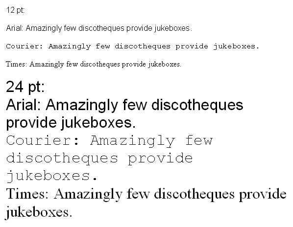
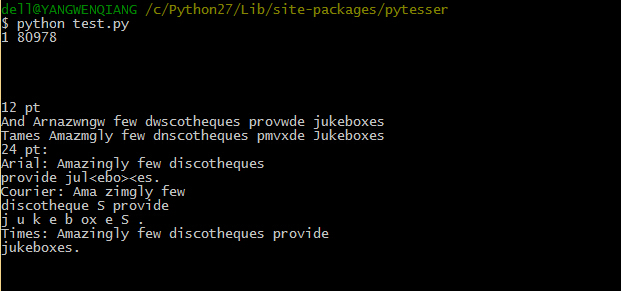

也只是因为在网上偶然间发现了一篇讲用Python识别验证码的博客，觉得非常神奇。Python什么时候还能干这么高大上的活了。仔细的看了一下，识别算法是Google的，一般也只能识别简单的验证码，复杂点的还是得要靠人工智能，机器学习什么什么的。      

首先是要下载安装几个需要的库。      
Python Image Library（PIL）Python的图像处理库。    
tesseract-ocr 谷歌的OCR识别引擎。     
tesseract Python的图像识别库。     

反正我试了很长时间没有弄好，现在只能做一些简单的识别。代码如下。
```python
from  pytesser import *
im1 = Image.open("code.png")
text1 = image_to_string(im1)
print text1
print "\n"
im2 = Image.open("fonts_test.png")
text2 = image_to_string(im2)
print text2
```
两张图片分别如下。    
     
    

识别出来的效果如下。    
     

参考链接：       
[python利用pytesser模块实现图片文字识别](http://www.jinglingshu.org/?p=9281)      
[ wxPython利用pytesser模块实现图片文字识别](http://blog.csdn.net/hk_jh/article/details/8961449)      
[Python 利用pytesser模块识别图像文字](http://www.cnblogs.com/chenbjin/p/4147564.html)      
[python验证码识别](http://www.ahlinux.com/python/10193.html)     
[使用Python进行验证码识别](http://www.pythonclub.org/project/captcha/python-pil)     
[利用python pytesser 识别简单验证码](http://blog.csdn.net/zq602316498/article/details/37817341)      
[python：验证码识别入门](http://blog.feshine.net/technology/1163.html)       
[python图像处理之二值去噪](http://blog.feshine.net/technology/1164.html)         
[python:验证码识别](http://blog.sina.com.cn/s/blog_a73687bc0101dpcg.html)       
