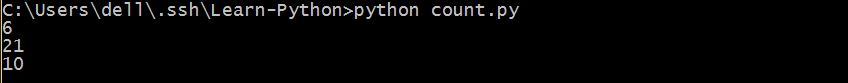
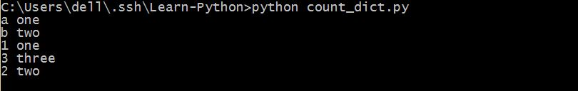
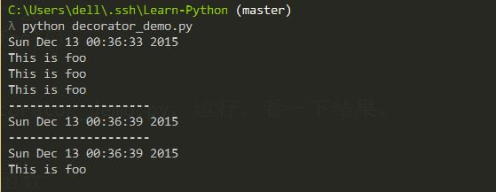
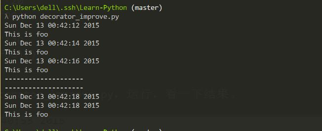
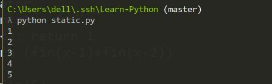
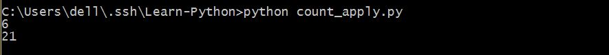
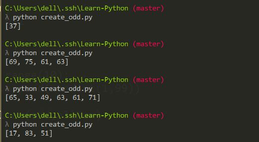
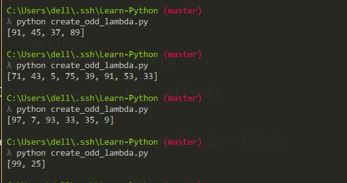
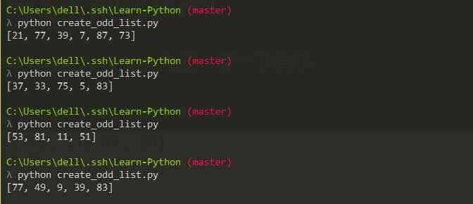
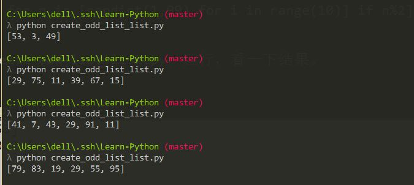

Python的内置函数主要包括两大类，一是Python的函数式编程用到的函数，一是Python对象的内置函数。                      

##函数式编程

####基本的内置函数
1. `type`判断对象类型                                    
```python
>>> type(1)
<type 'int'>
>>> a = 1
>>> type(a)
<type 'int'>
>>> type("a")
<type 'str'>
>>> type([1,2])
<type 'list'>
>>> type((1,2))
<type 'tuple'>
>>> type({1,2})
<type 'set'>
>>> type({1:'one',2:'two'})
<type 'dict'>
>>> type(int)
<type 'type'>
>>> type(long)
<type 'type'>
>>> def my():
...     pass
...
>>> type(my)
<type 'function'>
>>> class my:
...     pass
...
>>> type(my)
<type 'classobj'>
>>> a = my()
>>> type(a)
<type 'instance'>
>>> class my(object):
...     pass
...
>>> type(my)
<type 'type'>
>>> a = my()
>>> type(a)
<class '__main__.my'>
>>> type(type)
<type 'type'>
```

2. isinstance()判断变量

```python
>>> a = 1
>>> isinstance(a,int)
True
>>> isinstance(a,object)
True
>>> isinstance(a,type)
False
>>> isinstance(1,int)
True
>>> isinstance(1,object)
True
>>> isinstance(1,type)
False
>>> isinstance(1,str)
False
>>> isinstance("1",str)
True
>>> isinstance("1",object)
True
>>> isinstance(int,object)
True
>>> isinstance(int,type)
True
```

可以看到，在Python中其实也包含了万物皆对象的思想。                 

```python
>>> class foo:
...     name="foo"
...     def show():
...             print foo.name
...
>>> a = foo()
>>> isinstance(foo,object)
True
>>> isinstance(a,object)
True
>>> isinstance(a.show,object)
True
>>> isinstance(a,foo)
True
```

3. 对象类型转换 

|函数                   |说明                                             |
|:-----:                |:------:                                          |
|int(x=0[,base=10])     |将其他进制的字符串或数转化为十进制整数，若为十进制浮点数，则表示取整|
|long(x=0[,base=10])    |将其他进制的字符串或数转化为长型数|
|float(x=0)             |将其他进制的字符串或数转化为浮点数|
|round(x)               |将一个浮点数四舍五入进行取整      |
|complex(real [,imag ]) |创建一个复数                      |
|str()                  |将对象转换为字符串                |
|list()                 |将序列转换为列表                  |
|tuple()                |将序列转换为元组                  |
|set()                  |将序列转换为集合                  |
|chr()                  |将一个整数转化为相应的ASCII字符   |
|ord()                  |将一个ASCII字符转化为相应的整数   |
|hex()                  |将一个整数转化为十六进制编码字符串|
|oct()                  |将一个整数转化为八进制编码字符串  |
|unicode(string[,encoding])                  |将其他格式的字符串转化为Unicode格式的字符串               |

####id和del
查看变量位置和删除变量。                                    
id()用来查看变量在内存中的位置，在深拷贝和浅拷贝的区别的时候就是通过查看在内存中的位置来判断的。                           
Python是有自动的垃圾回收机制的，但是有时候我们想要显式的删除一个变量，就可以使用这个函数。                   

```python
>>> a = "a"
>>> a
'a'
>>> id(a)
39859168
>>> b = a
>>> b
'a'
>>> id(a)
39859168
>>> id(b)
39859168
>>> del a
>>> b
'a'
>>> id(b)
39859168
```

####input和raw_input
input()相当于eval(raw_input())，input()和raw_input()都是标准输入函数。                    
raw_input()表示输入原生字符串，得到一个字符串，input()则是将其进行转换，故得到的可以是整形或浮点型输入。                            

```python
>>> a = raw_input("Please input a string: ")
Please input a string: This is a string
>>> a
'This is a string'
>>> type(a)
<type 'str'>
>>> b = raw_input()
12345
>>> b
'12345'
>>> type(b)
<type 'str'>
>>> a = input("Please input a string: ")
Please input a string: "This is a string"
>>> a
'This is a string'
>>> type(a)
<type 'str'>
>>> b = input()
12345
>>> b
12345
>>> type(b)
<type 'int'>
```

所以可以看到在input()里直接输入字符串时需要加上引号，如果不加直接写就会报错，而且可以在input()里面直接进行函数表达式。              

```python
>>> a = input()
This is a string
Traceback (most recent call last):
  File "<stdin>", line 1, in <module>
  File "<string>", line 1
    This is a string
                   ^
SyntaxError: unexpected EOF while parsing
>>> a = input()
Thisisastring
Traceback (most recent call last):
  File "<stdin>", line 1, in <module>
  File "<string>", line 1, in <module>
NameError: name 'Thisisastring' is not defined
>>> a = input()
"Hello"+" "+"World"
>>> a
'Hello World'
>>> type(a)
<type 'str'>
>>> b = input()
100+200
>>> b
300
>>> type(b)
<type 'int'>
>>> b = input()
"100+200"
>>> b
'100+200'
>>> b = input()
"100"+"200"
>>> b
'100200'
```

####Python的序列里支持函数表达。   

```python
>>> a = [x for x in range(10)]
>>> a
[0, 1, 2, 3, 4, 5, 6, 7, 8, 9]
>>> a = [x**2 for x in range(10)]
>>> a
[0, 1, 4, 9, 16, 25, 36, 49, 64, 81]
>>> a = [x**3 for x in range(10) if x%3]
>>> a
[1, 8, 64, 125, 343, 512]
>>> a = [(x,y) for x in range(3) for y in range(5)]
>>> a
[(0, 0), (0, 1), (0, 2), (0, 3), (0, 4), (1, 0), (1, 1), (1, 2), (1, 3), (1, 4), (2, 0), (2, 1), (2, 2), (2, 3), (2, 4)]
>>> from random import randint
>>> nums = [randint(1,10) for i in range(2)]
>>> nums
[3, 6]
```     

这是列表解析，同样的，字典也支持这样的解析。                   

```python
>>> a
{'a': 10, 'b': 20}
>>> a = {1:'one',2:'two',3:'three'}
>>> b = {key:value for (key,value) in a.items() }
>>> b
{1: 'one', 2: 'two', 3: 'three'}
>>> b = {key:value for (key,value) in a.items() if key%2}
>>> b
{1: 'one', 3: 'three'}
>>> a = {key:value for key in range(1,4) for value in range(5) if value%key}
>>> a
{2: 3, 3: 4}
>>> a = {key:value for key in range(5) for value in range(5) if value>key}
>>> a
{0: 4, 1: 4, 2: 4, 3: 4}
>>> a = {key:value for key in range(5) for value in range(5) if value==key}
>>> a
{0: 0, 1: 1, 2: 2, 3: 3, 4: 4}
```

在这里，因为Python的字典的键具有互异性，所以每一次相同的键不同的值只会取最后一个，而列表无互异性。                        

```python
>>> [(key,value) for key in range(5) for value in range(5) if value>key]
[(0, 1), (0, 2), (0, 3), (0, 4), (1, 2), (1, 3), (1, 4), (2, 3), (2, 4), (3, 4)]
>>> {key:value for key in range(5) for value in range(5) if value>key}
{0: 4, 1: 4, 2: 4, 3: 4}
```

####Python函数支持不定长度的参数
用一个C语言里很经典的例子，求一个不定长度的数列的和。

```python
#coding=utf-8

def count(*args):
	num = 0
	for i in args:
		num += i
	return num

num = count(1,2,3)
print num

num = count(1,2,3,4,5,6)
print num

a = [1,2,3,4]
num = count(*a)
print num
```

保存为count.py，运行，看一下结果。                        


不仅仅是对列表类型的支持，字典也可以。                     

```python
#coding=utf-8

def echo(**arge):
	for (i,j) in arge.items():
		print i,j

echo(a="one",b="two")

#此处的键值不能为数字,必须为是一个变量
# echo(1="one",2="two")

echo(**{"1":"one","2":"two","3":"three"})

#此处的键值也不能为数字，必须是字符串
# echo(**{1:"one",2:"two",3:"three"})
```

保存为count_dict.py，运行，看一下结果。                        
                   

####Python 不再支持自加自减
在C语言或者是其他的大部分语言，自加自减都是很重要的一个运算符，但是可能是为了减少像`++i`和`i++`的歧义吧，反正是没有了。                                  
所以在Python里面`i++`会报错，而`++i`则没有任何反应，无论你在前面有多少个加号都没有任何反应`++++i`                                      

```python
>>> i = 0
>>> i++
  File "<stdin>", line 1
    i++
      ^
SyntaxError: invalid syntax
>>> i++++
  File "<stdin>", line 1
    i++++
        ^
SyntaxError: invalid syntax
>>> ++i
0
>>> ++++i
0
```

但是可能是弥补没有自加的缺陷吧，Python可以`**`，表示乘方。              

```python
>>> 2**3
8
>>> 3**2
9
```

还有另外一个惊人的特性，关于两个变量值的对换。                         

```python
>>> a = 1
>>> b = 2
>>> a,b = b,a
>>> a
2
>>> b
1
```

####zip
zip函数，压缩，即将多个列表压缩为一个列表，如果列表长度不等，即以最短的那个为准。         

```python
>>> zip([1,2,3],[4,5,6])
[(1, 4), (2, 5), (3, 6)]
>>> zip(range(1,5),range(3,9))
[(1, 3), (2, 4), (3, 5), (4, 6)]
>>> zip([1,2,3,4,5],["a","b","c","d"],(9,8,7))
[(1, 'a', 9), (2, 'b', 8), (3, 'c', 7)]
```


####help和__doc__
这两个是函数的内置函数，就是说每一个函数都会有这两个函数，实际上也可以用于函数库或者是类或者对象中。                                                   
他们的功能是查看该函数或者是函数库的说明文档。说明文档即函数声明之后第一个未被赋值的字符串，一般用`""`或者是`""""""`包围的部分。                            

```python
>>> def foo():
...     "This is for test function"
...     pass
...
>>> help(foo)
Help on function foo in module __main__:

foo()
    This is for test function

>>> foo.__doc__
'This is for test function'
>>> a = help(foo)
Help on function foo in module __main__:

foo()
    This is for test function

>>> print a
None
>>> b = foo.__doc__
>>> print b
This is for test function
```

可以看到它们虽然功能一样，但是也有少许的不同之处。
1. `help`不仅仅打印出了说明文档，还有一些函数的参数以及函数所在的主类等全部信息。`__doc__`则仅打印出说明文档。                        
2. `help`无返回值，直接打印出结果。`__doc__`返回一个字符串。

这两个函数在一些类库的学习中很有帮助，可以用来查看说明文档以及相关函数的参数。       

```python
>>> import urllib
>>> help(urllib)
Help on module urllib:

NAME
    urllib - Open an arbitrary URL.

FILE
    c:\python27\lib\urllib.py

DESCRIPTION
    See the following document for more info on URLs:
    "Names and Addresses, URIs, URLs, URNs, URCs", at
    http://www.w3.org/pub/WWW/Addressing/Overview.html

    See also the HTTP spec (from which the error codes are derived):
    "HTTP - Hypertext Transfer Protocol", at
    http://www.w3.org/pub/WWW/Protocols/

    Related standards and specs:
    - RFC1808: the "relative URL" spec. (authoritative status)
    - RFC1738 - the "URL standard". (authoritative status)
    - RFC1630 - the "URI spec". (informational status)

    The object returned by URLopener().open(file) will differ per
    protocol.  All you know is that is has methods read(), readline(),
    readlines(), fileno(), close() and info().  The read*(), fileno()
    and close() methods work like those of open files.
    The info() method returns a mimetools.Message object which can be
    used to query various info about the object, if available.
    (mimetools.Message objects are queried with the getheader() method.)

CLASSES
    URLopener
        FancyURLopener

    class FancyURLopener(URLopener)
     |  Derived class with handlers for errors we can handle (perhaps).
     |
     |  Methods defined here:
     |
     |  __init__(self, *args, **kwargs)

>>> urllib.__doc__
'Open an arbitrary URL.\n\nSee the following document for more info on URLs:\n"Names and Addresses, URIs, URLs, URNs, URCs"
 spec (from which the error codes are derived):\n"HTTP - Hypertext Transfer Protocol", at\nhttp://www.w3.org/pub/WWW/Protoc
thoritative status)\n- RFC1738 - the "URL standard". (authoritative status)\n- RFC1630 - the "URI spec". (informational sta
ol.  All you know is that is has methods read(), readline(),\nreadlines(), fileno(), close() and info().  The read*(), file
eturns a mimetools.Message object which can be\nused to query various info about the object, if available.\n(mimetools.Mess
>>> help(urllib.urlopen)
Help on function urlopen in module urllib:

urlopen(url, data=None, proxies=None, context=None)
    Create a file-like object for the specified URL to read from.

>>> urllib.urlopen.__doc__
'Create a file-like object for the specified URL to read from.'
>>>
```

当说明文档太长时，按`q`退出。                        
可以用`help`查看具体用法，用`__doc__`查看相关说明。                

####dir和__dict__
这是用来查看函数或者对象的属性和方法的。                          
dir()返回列表，\_\_dict\_\_返回字典。                              
在新式类与旧式类的比较中会用到这些函数。                     

```python
>>> def foo():
...     pass
...
>>> type(foo)
<type 'function'>
>>> dir(foo)
['__call__', '__class__', '__closure__', '__code__', '__defaults__', '__delattr__', '__dict__', '__doc__', '__format__', '__get__', '__getattribute__', '__globals__', '__hash__', '__init__', '__module__', '__name__', '__new__', '__reduce__', '__reduce_ex__', '__repr__', '__setattr__', '__sizeof__', '__str__', '__subclasshook__', 'func_closure', 'func_code', 'func_defaults', 'func_dict', 'func_doc', 'func_globals', 'func_name']
>>> foo.__dict__
{}
>>> class foo:
...     name="foo"
...     def bar():
...             print foo.name
...
>>> a = foo()
>>> type(foo)
<type 'classobj'>
>>> type(a)
<type 'instance'>
>>> dir(foo)
['__doc__', '__module__', 'bar', 'name']
>>> foo.__dict__
{'__module__': '__main__', 'bar': <function bar at 0x0265A330>, 'name': 'foo', '__doc__': None}
>>> dir(a)
['__doc__', '__module__', 'bar', 'name']
>>> a.__dict__
{}
>>> class foo(object):
...     name="foo"
...     def bar():
...             print foo.name
...
>>> a = foo()
>>> type(foo)
<type 'type'>
>>> type(a)
<class '__main__.foo'>
>>> dir(foo)
['__class__', '__delattr__', '__dict__', '__doc__', '__format__', '__getattribute__', '__hash__', '__init__', '__module__', '__new__', '__reduce__', '__reduce_ex__', '__repr__', '__setattr__', '__sizeof__', '__str__', '__subclasshook__', '__weakref__', 'bar', 'name']
>>> foo.__dict__
dict_proxy({'__module__': '__main__', 'bar': <function bar at 0x02AE4C70>, 'name': 'foo', '__dict__': <attribute '__dict__' of 'foo' objects>, '__weakref__': <attribute '__weakref__' of 'foo' objects>, '__doc__': None})
>>> dir(a)
['__class__', '__delattr__', '__dict__', '__doc__', '__format__', '__getattribute__', '__hash__', '__init__', '__module__', '__new__', '__reduce__', '__reduce_ex__', '__repr__', '__setattr__', '__sizeof__', '__str__', '__subclasshook__', '__weakref__', 'bar', 'name']
>>> a.__dict__
{}
```

####内嵌函数
在Python里面一个函数内部可以创建另一个函数并调用它，当然也只能在这个函数内部使用。

```python
>>> def foo():
...     print "foo"
...     def bar():
...             print "bar"
...     bar()
...
>>> foo()
foo
bar
>>> bar()
Traceback (most recent call last):
  File "<stdin>", line 1, in <module>
NameError: name 'bar' is not defined
```

####函数装饰器
装饰器实际上也是函数，它的功能是在类或者是函数运行之前或者是之后运行一些额外的代码。      
装饰器的使用也是与普通函数一致，让我们来试一下，首先是一个无参的装饰器，在代码执行前后加上执行时间。                             

```python
#coding=utf-8

from time import ctime,sleep

def timefun(func):
  print ctime()
  return func

@timefun
def foo():
  print "This is foo"

for i in range(3):
  foo()
  sleep(2)

print "-"*20
timefun(foo)

print "-"*20
timefun(foo)()
```

保存为decorator_demo.py，运行，看一下结果。                        
           

非常可惜的是，如果这样写的话，这个装饰器好像就只能使用一次，那我们想要在每一次调用的时候都打印出时间要怎么办呢？。                            
我们在装饰器里也定义了一个函数，使用内嵌函数就可以实现每次调用装饰器都打印出时间。        

```python
#coding=utf-8

from time import ctime,sleep

def timefun(func):
  def showtime():
    print ctime()
    return func()
  return showtime

@timefun
def foo():
  print "This is foo"

for i in range(3):
  foo()
  sleep(2)

print "-"*20
timefun(foo)

print "-"*20
timefun(foo)()
```

保存为decorator_improve.py，运行，看一下结果。                          
                         

但是如果这样的话，就没有任何的区别了。                             

```python
#coding=utf-8

from time import ctime,sleep

def timefun(func):
  def showtime():
    print ctime()
    return func
  return showtime()

@timefun
def foo():
  print "This is foo"

for i in range(3):
  foo()
  sleep(2)

print "-"*20
timefun(foo)

print "-"*20
timefun(foo)()
```

保存为decorator_back.py，运行，看一下效果。                        
             

装饰器也可以是一个类，使用`__call__`函数，使在每次调用的时候使用装饰器即可。             
现在就大概明白了，装饰器的功能就是在原有的函数功能的基础上包装一下，给它增加新的功能。
>或许有人会问，那为什么我们不去重写这个函数呢？
>1. 或许这个函数是标准函数库里的或者是他人写的函数，不好修改，我们只需给它加上一些装饰而已，就会比较简单。
>2. 或许我们并不是每一个函数都需要装饰，这样的话，更容易控制。            

装饰器用来做静态变量。                               

Python里是没有静态变量的，只有静态成员变量，但是我们有时候需要在函数里调用静态变量，可是又不想创建一个类，怎么办呢？                                    

首先是来看一下Python里面没有静态变量                            

```python
>>> def fin(x):
...     _i = 0
...     _i = _i+1
...     print _i
...     if x<2: return 1
...     return (fin(x-1)+fin(x-2))
...
>>> fin(5)
1
1
1
1
1
1
1
1
1
1
1
1
1
1
1
8
```

我们利用装饰器当做静态变量，但是非常坑爹的是，在非递归调用里可以正常使用，完全当做一个静态变量，但是在递归调用里就出问题。                        

```python
#coding=utf-8

def static(func):
  def count(*args):
    count._call += 1
    print count._call
    func(*args)
  count._call = 0
  return count

#在非递归调用中完全可以当做静态变量来使用
@static
def echo():
  pass

for i in range(5):
  echo()

#但是在递归调用中就出问题
# @static
# def fin(x):
#   if x<2: return 1
#   return (fin(x-1)+fin(x-2))

# print fin(5)
```

保存为static.py，运行，看一下结果。                               



####匿名函数
匿名函数的关键字是lambda，结构是` lambda [arg1[,arg2[,...]]] : expression `               
匿名函数也可以有参数，甚至默认参数或者不定参数，也有函数表达式。只不过因为是匿名函数，所以需要在完成时即调用，或者将函数保存为变量，就可以通过调用变量来使用匿名函数。               

一个简单的例子，a+b，b的默认值为 0 。           

```python
>>> def add(a,b=0):
...     return a+b
...
>>> add(1,2)
3
>>> add(1)
1
>>> add = lambda a,b=0 : a+b
>>> add(1,2)
3
>>> add(1)
1
```

####apply filter map reduce

######apply(function,arges)
apply的功能是在不定长参数的函数中应用，在我们上面讲到不定长参数的使用时，传入一个序列或者字典时可以采用加`*`或者是`**`的形式，将序列传入函数，也可以采用apply。                       


用Python实现apply函数                         

```python
def apply(func,args):
  return func(*args)
```

其实不仅仅是不定长参数的函数，即使是在定长参数的函数中，如果需要多个参数也能使用。       
apply或者`*`,`**`是为了一次性传入一个列表或者字典，但是将它们内部的值逐个解析出来。       
在Python 1.6 之后，这个函数将被逐步取代，apply只能传入序列。                          

```python
#coding=utf-8

def count(*args):
  num = 0
  for i in args:
    num += i
  return num

num = apply(count,[1,2,3])
print num

a = [1,2,3,4,5,6]
num = apply(count,a)
print num
```

保存为count_apply.py，运行，看一下结果。                                     


######filter(func,seq)
fulter即过滤器，给定一个过滤函数和序列，每个序列元素都经过这个过滤函数删选，保留返回为真的元素。                                

用Python实现filter函数                 

```python
def filter(func,seq):
  filtered_seq = []
  for each in seq:
    if func(each):
      filtered_seq.append(each)
  return filtered_seq
```

例如我们现在随机产生10个100以内的整数，然后返回其中的所有奇数。                

```python
#coding=utf-8

from random import randint

def odd(n):
  return n%2

allNum = []

for i in range(10):
  allNum.append(randint(1,99))

print filter(odd,allNum)
```

保存为create_odd.py，运行，看一下结果。                                 
                

可以看到每次结果都不一样，且返回不多于10个的奇数。                         

第一次重构

```python
#coding=utf-8

from random import randint

allNum = []

for i in range(10):
  allNum.append(randint(1,99))

print filter(lambda n : n%2 ,allNum)
```

保存为create_odd_lambda.py，运行，看一下结果。                       
                  

第二次重构

```python
#coding=utf-8

from random import randint

allNum = []

for i in range(10):
  allNum.append(randint(1,99))

print [n for n in allNum if n%2]
```

保存为create_odd_list.py，运行，看一下结果。                      
                  

第三次重构

```python
#coding=utf-8

from random import randint

print [n for n in [randint(1,99) for i in range(10)] if n%2]
```

保存为create_odd_list_list.py，运行，看一下结果。                       


######map(func,seq)
这个与apply()类似，也是将一个序列映射到函数上，不过这个不是将序列的值一次全部传入函数，而是将序列每个的值依次传入函数，然后将每次函数返回值组成序列返回。           

用Python实现map函数          

```python
def map(func,seq):
  mapped_seq = []
  for each in seq:
    mapped_seq.append(func(seq))
  return seq
```

小例子          

```python
>>> map(lambda x:x**2,[1,2,3])
[1, 4, 9]
>>> map(lambda x:x+2 ,range(5))
[2, 3, 4, 5, 6]
```

其实，它不仅能够支持函数的一个参数输入，还能够多个参数输入。              

```python
>>> map(lambda x,y:x+y ,[1,2,3],[4,5,6])
[5, 7, 9]
>>> map(lambda x,y:(x+y,x-y) ,[1,2,3],[4,5,6])
[(5, -3), (7, -3), (9, -3)]
>>> map(None ,[1,2,3],[4,5,6])
[(1, 4), (2, 5), (3, 6)]
```

######reduce()


##对象内置函数

包括`__name__` `__call__` `__init__` `__main__`
