中文编码确实是非常蛋疼的一件事。  
在数据库里尤甚。MySQL的默认字符串集是拉丁语，真是~~  
而且，在MySQL数据库中，没有UTF-8，也没有utf-8，而是utf8.    
现在在我的电脑里的MySQL无法存入中文，类似于这样。  
  
我在数据库的表选项的编码格式里面也选择了`utf8_general_ci`然而还是没有什么用。  
在数据从PHP传到数据库的时候还专门做了转码utf-8，然而还是传不进来。  
后经高人指点，在MySQL控制台内输入`show variables like "%character%";`  
即可看到整个数据库的编码格式。  
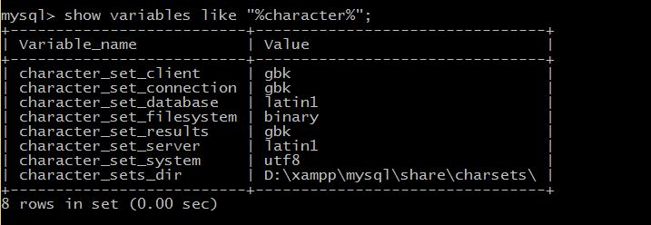  

- 第一行表示MySQL客户端的编码格式GBK
- 第二行表示MySQL连接时的编码格式GBK
- 第三行表示数据库**拉丁语编码**格式
- 第四行表示文件存储编码格式二进制
- 第五行表示显示结果的编码格式GBK
- 第六行表示数据库服务器端的**拉丁语编码**格式
- 第七行表示数据库所在系统的编码格式utf-8。

>除了文件存储格式二进制是对的和数据库所在的系统的编码格式，其他都是错误的吖！

正确的应该是这个样子的。

```bash
+--------------------------+----------------------------+
| Variable_name            | Value                      |
+--------------------------+----------------------------+
| character_set_client     | utf8                       |
| character_set_connection | utf8                       |
| character_set_database   | utf8                       |
| character_set_filesystem | binary                     |
| character_set_results    | utf8                       |
| character_set_server     | utf8                       |
| character_set_system     | utf8                       |
| character_sets_dir       | /usr/share/mysql/charsets/ |
+--------------------------+----------------------------+
```

然后还有一个地方也要看一下，就像查看一下我的MySQL的`test`的数据库的`baoweichu`表单的编码格式。  
先用`use test;`找到那个数据库，然后`show create table baoweichu;`。  
就可以看到，是这个样子的。  
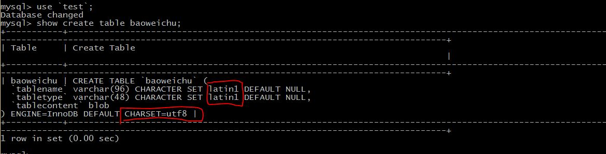  
虽然下面的那个地方是写的utf-8的编码格式，不过上面的不对，在表单里面的存储编码格式还是拉丁语编码。  

正确的编码格式应该是这个样子的。  
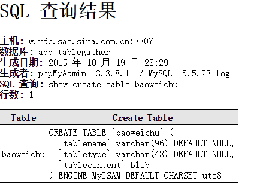

所以只有把所有的编码格式都正确了之后，才能够在数据库里写上正确的中文。  


`utf8`，`utf-8`与`UTF-8`不是同一个意思，/(ㄒoㄒ)/~~在MySQL里是`utf8`

至于我们为什么要把编码格式都改成utf-8，因为utf-8是能够存储更多的字符，，包括全球所有的语言，是大势所趋。而GBK是中国的标准，不仅支持的汉字数量远不足utf-8，而且在几种GBK的编码方式中相互都不兼容，虽然目前的Windows操作系统中中文的默认编码格式是GBK，但是GBK编码的很多缺点已经越来越明显。  

####修复数据库编码问题

1. Linux
我是在Ubuntu下装的MySQL，使用`SHOW VARIABLES LIKE ‘%character%’;`后查看的结果是这样。  
```
+--------------------------+----------------------------+
| Variable_name | Value |
+--------------------------+----------------------------+
| character_set_client | utf8 |
| character_set_connection | utf8 |
| character_set_database | latin1 |
| character_set_filesystem | binary |
| character_set_results | utf8 |
| character_set_server | latin1 |
| character_set_system | utf8 |
| character_sets_dir | /usr/share/mysql/charsets/ |
+--------------------------+----------------------------+
```
可以看到除了前面的两个是utf8与我之前在Windows下不同之外，其他的有问题的地方与在Windows下是一样的，因为Linux下没有GBK编码，默认编码格式即utf-8，所以比Windows的情况好一点。   
**解决办法**  
 1. 修改mysql的my.cnf文件中的字符集键值`sudo vim /etc/mysql/my.cnf`  
  - 在`[client]`字段中加入`default-character-set=utf8`  
  - 在`[mysqld]`字段张加入`character-set-server=utf8`  
  - 在`[mysql]`字段中加入`default-character-set=utf8`（注意，一个是mysql，一个是mysqld）  
 2. 然后再重启MySQL就可以了，但是我的MySQL在这里重启的时候出了一点问题，没有办法关掉。我就把系统重启了一下，再次进入MySQL就可以看到数据库编码已经完全恢复了正常。  
 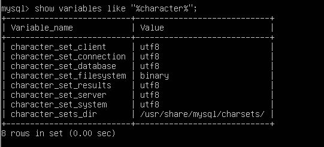  
 3. 如果还有问题，那就是在连接的时候出了问题，在sql语句执行的最前面加上这句代码`SET NAMES ‘utf8′;`,它相当于一下三条代码。  
 ·`
  SET character_set_client = utf8;  
  SET character_set_results = utf8;  
  SET character_set_connection = utf8;  
  `
2. Windows
我也在Windows下安装了MySQL，中文编码问题非常严重，在网上找的教程有一点的问题，最终解决了。  
一开始我的数据库编码是这样的。   
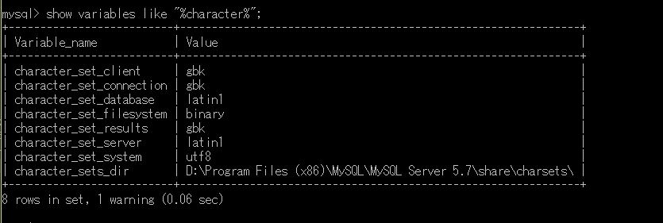  
简直惨不忍睹，各种编码格式，在网上找了教程步骤也是跟上面的一样，分别在三个地方加上设定默认编码格式就好了。  但是我的my.ini的内容是这样的，根本就没有那些字段。
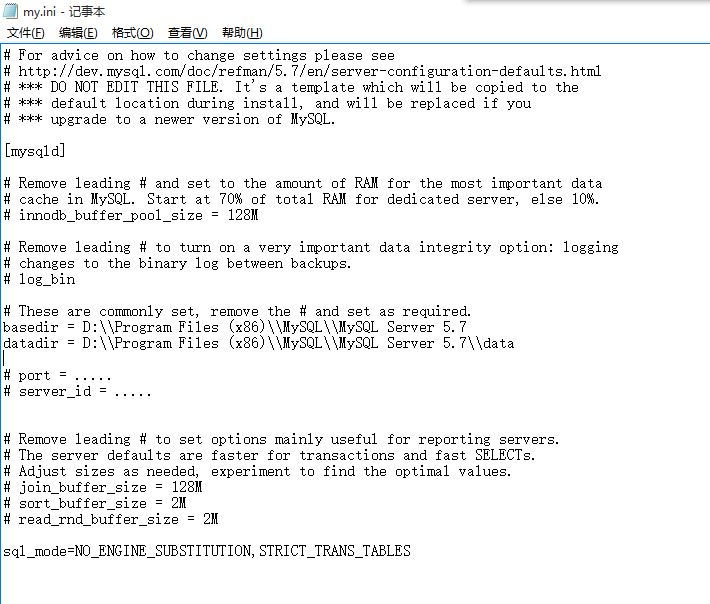  
 1. 那我们先自己加上一个字段`[client]`,并在这个的下一行加上`default-character-set = utf8`，保存看一下结果。当然，先重启MySQL。  
此时我的`my.ini`是这个样子的。   
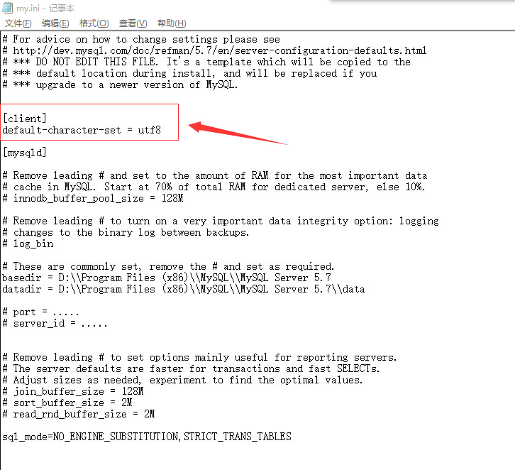  
此时我的MySQL是这个样子的。  
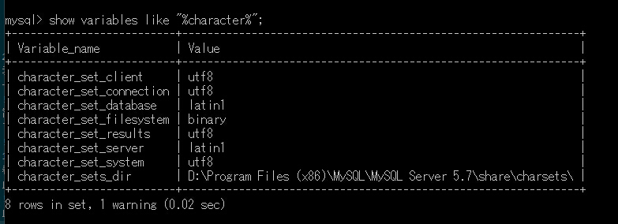  
太棒了，多了俩utf8。  
 2.那我们在`my.ini`里面再加上一个字段`[mysql]`，并在这个的下一行加上`default-character-set = utf8`，保存看一下结果。当然先重启MySQL。  
此时我的`my.ini`是这个样子的。  
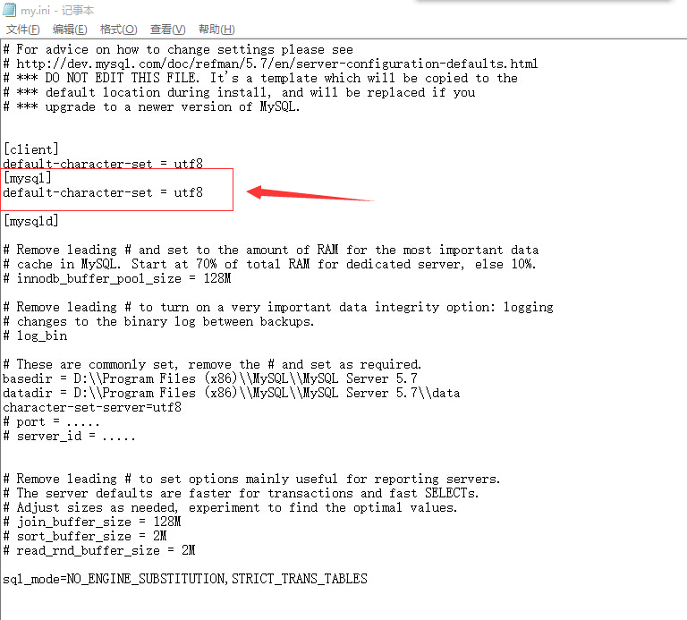  
此时我的MySQL是这个样子的。  
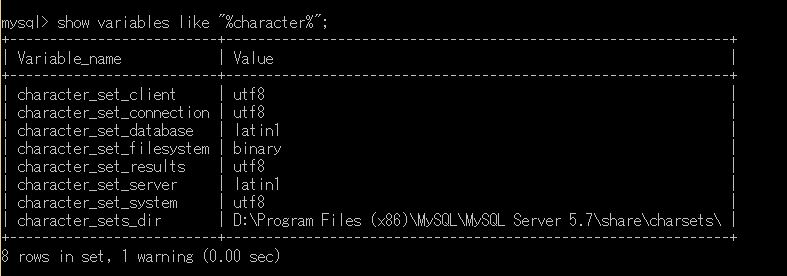  
跟之前没有什么变化嘛~  (⊙o⊙)… 没事，还有一步。
 3. 我们在`my.ini`的仅有的一个字段`[mysqld]`里面再加上这一句`character-set-server=utf8`,保存看一下结果。当然，先重启MySQL。   
此时我的`my.ini`是这个样子的。  
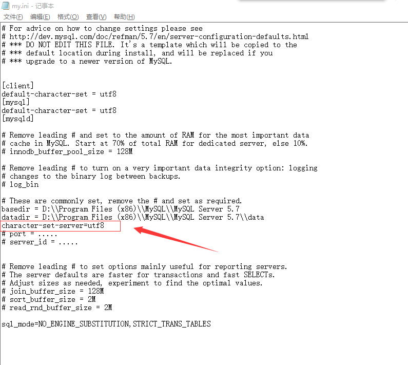
此时我的MySQL是这个样子的。  
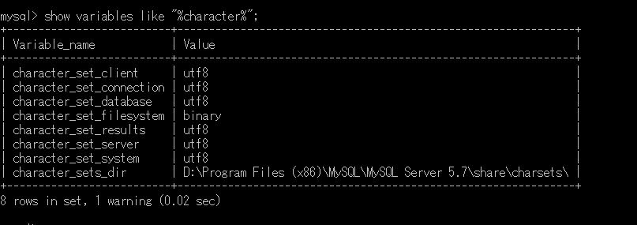
完成了，哦也\\(\^o\^)/.   


>设定与数据库的连接的编码格式,这是在Linux下和Windows下通用的。
```php
mysql_query("SET NAMES 'UTF8'"); 
#如果是用mysqli就是这个
#mysqli_set_charset($recouce ,"utf8");
```
