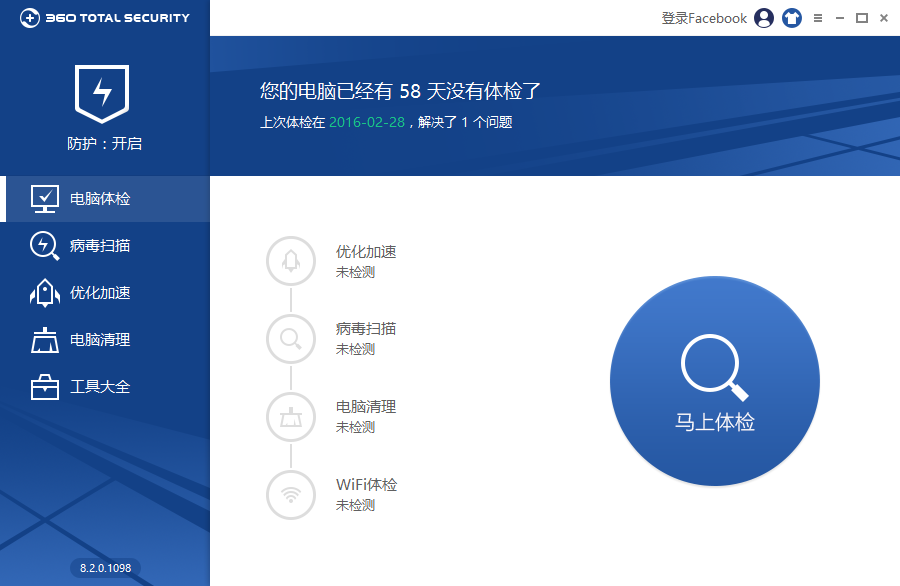
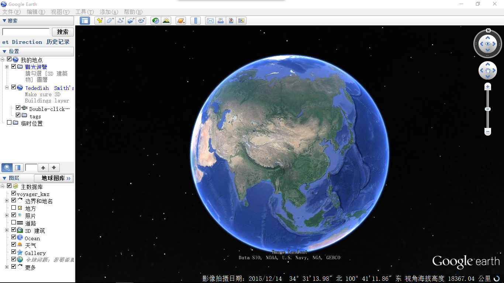
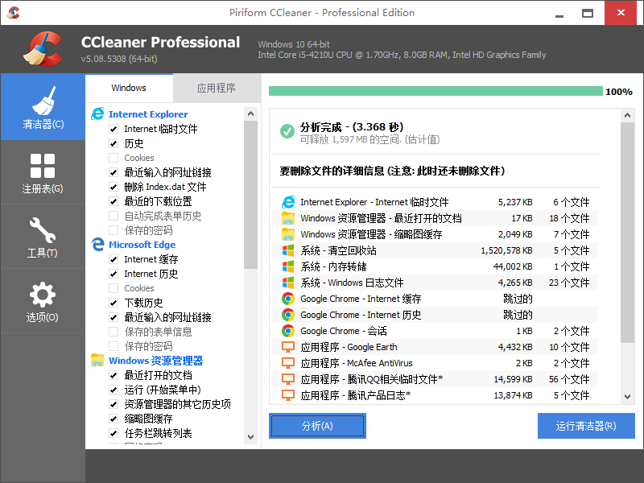

自从今年换了装上了Ubuntu gnome的双系统之后，明显觉得使用Linux操作系统比Windows好用多了。因为自己硬盘的原因，空间不够大，不能装三系统，等等，想把主要的操作系统换成Ubuntu，所以把现在在用的Windows下常用软件总结一个，make a list

## 列表开始了

1. 360国际版
个人本身是非常不喜欢360的，看到同学用360浏览器或者安全卫士什么的就觉得不太舒服，还有各种卫士的小球球。但是这个360国际版竟然还可以，只有一些基本的功能，UI也还可以

2. Adobe Application Manager
什么玩意儿，还总是经常提醒我更新，自从我知道flash有很多安全漏洞，chrome都不自带flash之后，就开始对Adobe公司没什么好感了，这个应该是我之前安装它们的PS时带的，虽然从来都没有用过PS

3. Axure RP Pro 7.0
用来画UI，设计师和产品经理需要它来设计需要的APP界面或者是网站界面，但是我不会用

4. Bitstream Font Navigator (64-Bit)
不知道是什么玩意儿，我甚至都不知道我的电脑上还有这个东西，百度一下才知道原来是字体管理软件，应该是我安装CD的时候连带的

5. chrome
谷歌浏览器，我的所有系统上必备软件，翻墙之后所有的浏览器数据全部可以同步，包括cookie和密码，一般都放在快速启动栏里，奇怪为什么这个快捷方式不能用了

6. clover
可以将你的文件管理器变得跟谷歌浏览器一样，可是在Windows10上有兼容性问题，最终放弃了，为什么还有快捷方式

5. Corel CAPTURE X7 (64-Bit)
CorelDRAE的一个软件，捕获窗口，不如 FastStone 好用

6. Corel CONNECT X7 (64-Bit)
CorelDRAE的一个软件，图像处理

7. Corel FastFlick X7
会声会影的一个软件，用来做简单的视频处理

8. Corel PHOTO-PAINT X7 (64-Bit)
CorelDRAE的一个软件，图像处理

9. Corel ScreenCap X7
会声会影的一个软件，屏幕录制

10. Corel VideoStudio Pro X7
会声会影，视频处理

11. CorelDRAW X7 (64-Bit)
CorelDRAW，图像处理

12. EasyBCD 2.2
增加电脑启动引导，装双系统的用的

13. Eclipse
Java的IDE，从来没用过，还不如用编辑器然后在cmd里编译，比较习惯这种方式，C语言也是用gcc在cmd里编译，不喜欢笨重的IDE

14. Evernote
印象笔记，曾使用过，不好用，UI也不漂亮，果断放弃，使用国产的为止笔记，全平台，在我的Ubuntu和iPad和iPhone上都在用。

15. FileZilla Server Interface
FTP服务器，曾经用过。

16. FineReader
PDF转Word，最终发现还不如用一些网上的网站转方便，比如说[smallpdf](http://smallpdf.com/cn)

17. gcc
C语言编译器，好东西，直接给你生成一个EXE文件。用法：gcc filename.c -o filename

18. Git Bash
分布式版本控制系统，好东西，与SVN齐名。一般用来连接Github（这个是个好地方），之前用过Github for Windows，不好用，放弃

19. Google Chrome
这个才是真正的chrome的快捷方式，上面那个不能用

20. Google Earth
可以看到地球全景的呦，能以3D模型的方式看到地球上的任何地方，对你的电脑GPU是一个严重的考验

21. Haroopad - The next document processor
Markdown编辑器，我以前用的是markdownpad，但是在Windows10上有兼容性问题就改用这个，后来兼容性问题修好了，但是我都不想用了。在chrome上装了一个markdown实时预览的插件就可以在sublime里面编辑markdown

22. iDisplay
用来与iPad进行屏幕共享，本来一开始是想用电脑操纵iPad的，使用了好几个软件发现都不行，只能实现使用iPad操作电脑，猜测可能是苹果没有给APP操作整个iPad的权限

23. IETester
用来测试那些较老的该死的IE用的，前端或许需要这个

24. Internet Explore
自带的IE11，几乎从来没有打开过

25. iTools 3
用来取代iTunes连接苹果设备的，我的iPhone和iPad需要用这个传输文件，这个也是使用 Windows 的必备原因之一，另一个是QQ

26. Lantern
翻墙工具，我的一个好友就是用这个翻墙的，以前用过感觉不太稳定，现在使用 ss

27. MATLAB
大一下学期上线性代数的时候用过，装下来十个 G 左右，然后在做数模的时候用了一下就再也没有用过了

28. McAfee Security Scan Plus
应该是自带的，没有用过，其实自带的 Windows defender 挺好的

29. Mozilla Firefox
Firefox浏览器，也是做前端用的，启动较慢，使用的较少。为了做前端，我装了好几个浏览器

30. Nmap - Zenmap GUI
nmap 端口扫描，网络安全必备

31. Photoshop  6.0
PS 好像是没有用过，我也不会用，一些简单的p图用的是 FastStone ，去水印也有一个专门的软件叫 Inpaint

32. Picasa 3
谷歌的图像查看器，据说很强大，我可能没有用出来

33. QuickTime Player
装会声会影的时候会自带给你装上两个其他的软件，一个是谷歌的chrome浏览器，一个是苹果的QuickTime播放器，那个确实有用，但是这个就没有怎么用了

34. Safari
Safari浏览器，我一开始也没有想到竟然会有Windows版的，果然官网已经找不到了，很多年前就已经停止开发了，这个是很久的版本

35. sublime_text
最常用的软件之一，在我的每一个操作系统上都用它，最好的编译器

36. TrIDNet
文件分析器，根据文件标识符找出真实的文件类型，判断是否文件被隐写

37. UltraISO
制作U盘启动盘

38. Visual C++  6.0
C语言IDE，学的第一门编程语言，用的第一个IDE。VC6.0是十几年前发布的，竟然在 Windows 10 上还能用

39. VMware Workstation
虚拟机，之前用过另一个虚拟机 VirtualBox ，感觉不如这个好用，改用 VMware ，后来在Ubuntu上因为没法用 VMware ，又开始用 VirtualBox ，着实不如这个好用

40. VNC Viewer
远程桌面客户端，之前玩过树莓派，用这个连接树莓派的远程桌面，当时还是挺兴奋的

41. WinHex
十六进制查看器，一般用来看图片隐写

42. Wireshark
抓包工具，网络安全必备

43. WPS表格
WPS Excel，没钱用office，也因为那个比较占空间，而我的电脑也已经剩余空间不多了

44. WPS文字
WPS Word

45. WPS演示
WPS PowerPoint

46. XMind Pro
画脑图的，之前也用过 freemind ，感觉没这个好用，现在觉得都不好用

47. 百度云管家
百度云，百度唯一的良心产品。还是挺好用的，特别是有的时候一些比较大的文件，可以用百度云的离线下载，先放在百度云上然后通过百度云下载下来。可惜就是它限速吖，非要会员才不限速，不过没关系，我已经有一个百度云破解版了

48. 暴风影音5
一般用来看看视频电影什么的，虽然总是有人推荐一些其他的更好的视频软件，但是都不想试，这个能够正常的播放大部分格式电影，能够方便的加载字幕就已经足够了。

49. 福昕阅读器
PDF阅读器，发现这个还不如另外一款福昕阅读器，可以可以增删 PDF 某一页

50. 格式工厂
格式转换，一般用的很少

51. 回收站
Windows 的回收站，也给弄了一个快捷方式

52. 金山PDF转Word
WPS的PDF转Word，不过没有用过

53. 酷狗音乐
总是有人推荐网易云音乐更好一些，但是没用过，懒得换了

54. 猎豹WiFi
虽然可以在cmd里开 WiFi ，但是有一个专门开 WiFi 的软件还是要方便一些，可以查看上传下载网速和使用了多少流量

55. 驱动精灵
检查和更新驱动，之前还用过驱动人生，简直流氓软件，我这个也是经过绿化纯净之后的

56. 数学公式
在数模的时候用到过，写复杂的数学公式用

57. 腾讯QQ
虽然可以用QQ轻聊版，而且QQ轻聊版要好一些，但是同样的道理懒得换了，在新系统上就是用的轻聊版。这也是 Windows 的必备原因之一

58. 微信
不好用，登陆微信还要手机微信扫一扫，使用电脑版微信就是因为手机没带的时候吖，什么玩意儿

59. 为知笔记 Wiz
必备软件之一，主要用来将网页内容保存下来同步到iPad上看，或者就是保存下来而已

60. 向日葵客户端
Windows与iPad屏幕共享软件之一

61. Air Display
Windows与iPad屏幕共享软件之一

62. easyConverter
PDF转Word软件之一，没什么卵用

61. 迅雷极速版
虽然有人说一个叫做猎鹰的下载器更好一些，但是这个迅雷极速版已经可以了，虽然下载速度可能还是有一点限制，不过我可以买几毛钱的会员，而且这个相对于正常的迅雷要好很多

62. 银联安全控件非插件版1.0.0.1
什么玩意儿，有的银行非得要用IE，什么习惯，还非得要这个什么安全控件，结果还不是不能用

63. 云窗
西安电子科技大学和其他的什么企业做的，除了可以在线看视频不走外网流量之后毫无用处，而我一般习惯把视频下载下来看

64. Eage
Windows 10 的浏览器，感觉还可以，不过还是不如 chrome ，用的少

65. FastStone Capture
截屏录屏修图，功能很多的小工具

66. TakeColor
屏幕取色器，前端必备

67. uTorrent
西安电子科技大学睿思西下载器，其实就是一个普通的下载器，不过下载我们的校内资源可以不费外网流量以及比较快

68. MarkMan
图片长度标记，用的少

69. CCleaner
垃圾清理和注册表清理，挺好用的一个小工具

70. EA-Key
没什么卵用，一个文件加密工具，使用 AES256 加密方式

71. TortoiseSVN
Windows 下的SVN客户端之一，这里就不评判git和SVN的优劣了，最好是两个都掌握

72. FlashFXP
FTP客户端，还是很有用的，虽然在Windows下可以开启FTP服务，但是没有sftp吖，现在大部分FTP都是sftp了，更加安全可靠

73. vim
对，Linux下必备的vim是个好东西，我还安装了很多其他的Linux下软件，比如说bash

74. IDA 6.5
软件逆向用的，虽然我并不会用

75. Image Viewer for Windows 7
因为看到了网上的谣传说 Windows 下看不了GIF动态图，就下载了这个软件用来看动态图，后来才知道 Windows 10  下自带的图片查看器是可以看GIF动态图的

76. Awesomium SDK
用来帮助 markdownpad 在 Windows 10 下的兼容性

77. Launchy_2.5
一个快速启动器，比较炫酷，因为比较占内存和显存就没有用，还不如用运行呢。类似的快速启动器还有 SAO Utils 和 水滴 更加炫酷

78. MarkdownPad.2.4.2
感觉是 Windows 下最好的 markdown 编辑器了，虽然我现在一般用 sublime 直接编辑 markdown

79. NTKO OFFICE
可以在浏览器中直接编辑 office 三件套，不过一般不会有人这样做的吧。。。还不如用苹果的 iCloud ，可以免费用苹果的三件套

80. Opera
欧朋浏览器，也是一个比较小众的浏览器，据说启动比较快，可是它的最新版也开始使用chrome的内核了，其实Firefox也开始和chrome越来越像了

81. SogouInput
搜狗输入法，还是国产输入法懂中国人，对搜狗唯一的印象就是它们的输入法了

82. Tesseract-OCR
谷歌的图像识别引擎，在 Windows 下安装一半天还不好用，Ubuntu 竟然自带，可惜识别的效果不太好

83. cmder
一个 cmd 的增强版，而且会自带一些Linux下的命令，如 ls，curl，wget，之类的，但是启动太慢了，不好用

84. Everything
Windows下文件查找器，确实好用，找文件只在瞬间

85. iDocDown
冰点文库，专门用来下载百度文库的内容，不用金币不用登陆，用的纯净版，挺好用的

86. Inpaint
图像处理，专门用来去水印

87. PhotoZoomPortable
图像处理，专门用来无损增大图像

88. ScreenToGIF
屏幕录制工具，不过是专门用来生成GIF的

89. DiskGenius
磁盘修复，数据恢复的好工具

90. IMGtoISO
将img格式的镜像文件转化为ISO格式

91. win32DiskImager
SD卡写入，烧录SD卡

92. Panasonic_SDFormatter
烧录之后的SD卡修复

89. WinRAR
必备的，压缩工具

90. Shadowsocks-win-2.5.6
ss，翻墙小工具，好东西

91. Vitrite
可以将软件虚化，就是将你的桌面上的正在运行的软件更改透明度

93. putty
菩提，这么重要的软件怎么能忘呢？ssh远程登陆，管理服务器必备。

94. FlashFXP
ftp上传下载文件用的，也是连接远程服务器，或者是sftp。

95. WinSCP
功能同上，也是ftp工具。

92. WinPcap
Windows 下的一个小工具，可以更改网卡设置用来抓包，在安装 wireshark 时附带

92. burpsuite1.6.09
抓包并更改，爆破工具，网络安全必备

93. sqlmap
sql注入，网络安全必备

94. OllyDbg
软件逆向用的，虽然我并不会用

95. gunwin32
可以在Windows下使用Linux下的命令

96. MinGW
在Windows下搭建各种编译环境

95. Apache
web服务器，还是需要一个的

96. MySQL
既然有了web服务器，接下来就是web服务了，PHP和MySQL天造地设的一对

97. PHP
web后端，也是编程语言

98. sqlite3
SQLite 终端

98. Python27
Python 2.7 编译器

99. Python34
Python 3.4 编译器

100. Java
Java 1.8.60 编译器

101. Perl64
Perl 6.4 编译器

102. Go
Golang 编译器

103. nodejs
node编译器

104. Ruby22
ruby 2.2 编译器

105. OpenSSL
Windows 下的 OpenSSL ，我不确定它能用

106. Ext2Read
在Windows下查看 Ext 文件格式的磁盘

## 整理一下

### 必备软件
1. Chrome
3. Sublime

### 基础软件
1. WinRAR
6. 搜狗输入法
2. 为知笔记
2. QQ轻聊版
4. Git
5. WPS
5. iTools
1. 百度云管家
4. shadowsocks
7. CCleaner
8. 迅雷极速版
9. Everything
10. 酷狗音乐
11. 暴风影音
5. 360国际版
6. FastStone Capture
